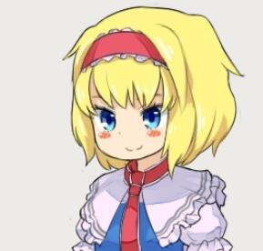
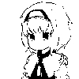
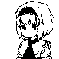

### yukkuri

#### 概要

由Golang实现的一个小功能，可将图片转为油库里(Ascii字符画)，输出结果偏油库里风格

- [下载](https://github.com/nynicg/yukkuri/releases)


#### 依赖 

- 图片处理： [resize](https://github.com/nfnt/resize)


#### 使用


```
// necessary dependencies
go get github.com/nfnt/resize

go build yukkuri

// help
yukkuri -h
  -H int
        set ascii max height (default -1)
  -W int
        set ascii max width (default -1)
  -f string
        specify an image file to transcode
  -h    help
  -m string
        save temporary image
  -n string
        set output file name (default "tmp.txt")
  -t int
        set threshold for image grey processing (default 140)
  -y    make the output ascii more like yukkuri style,but more likely to be unrecognizable
```

- 将图片转为ASCII码字符画

	`yukkuri -f icg.jpg`
	
	同目录下会出现默认名为`tmp.txt`的文本文件，ASCII字符已被写入其中，查看时最好使用等宽字体，若图片较大需要调整字体大小或缩放编辑器界面才能完整显示，或是加入`-H 100 -W 100`参数限制输出长宽，但该参数将依赖于`github.com/nfnt/resize`包的图片缩放效果，可能会导致输出失真
	
- 限制输出矩阵长宽

	`yukkuri -f icg.jpg -W 100 -H 100`
	
- 保存经过灰度处理的临时图片

  `yukkuri -f icg.jpg -m tmp.jpg`

  当输出失真较严重时，可使用`-m`保存灰度图像，观察图像状况，使用参数`-t`调整。
  参数`-t`为灰度处理的阈值，取值为0  -  255 ，默认140，取值越小，输出的空白越多。当输出的ASCII字符没有明显勾画出图像的轮廓时，应当适当调高该阈值。

#### 处理过程

- 原始输入

  

- 设置阈值140

  `yukkuri -f icg.jpg -W 100 -H 100 -m tmp.jpg -t 140`

  此时部分轮廓已消失，由此输出的ASCII基本无法辨认(节约篇幅没有给出ASCII字符画输出)

  


- 设置阈值150

  `yukkuri -f icg.jpg -W 100 -H 100 -m tmp.jpg -t 150`

  阈值调高10图像更加清晰，输出的ASCII易于辨认

  

  > 原图像的构造会很大程度地影响还原效果。线条越简单的图像越容易在较少的输出(<50*50)下被还原。

#### 输出示例

- 命令：`yukkuri -f icg.jpg -W 150 -H 150` 

  输出：[tmp.txt](tmp.txt)

- 启用`-y`参数使用另一套ASCII字符: `yukkuri -f icg.jpg -t 152 -n tmp_ykr.txt -y`

  `-y`会将输入自动压缩3*3倍

  输出：[tmp_ykr.txt](tmp_ykr.txt)

  > 建议使用 notepad++ / Consolas 打开
